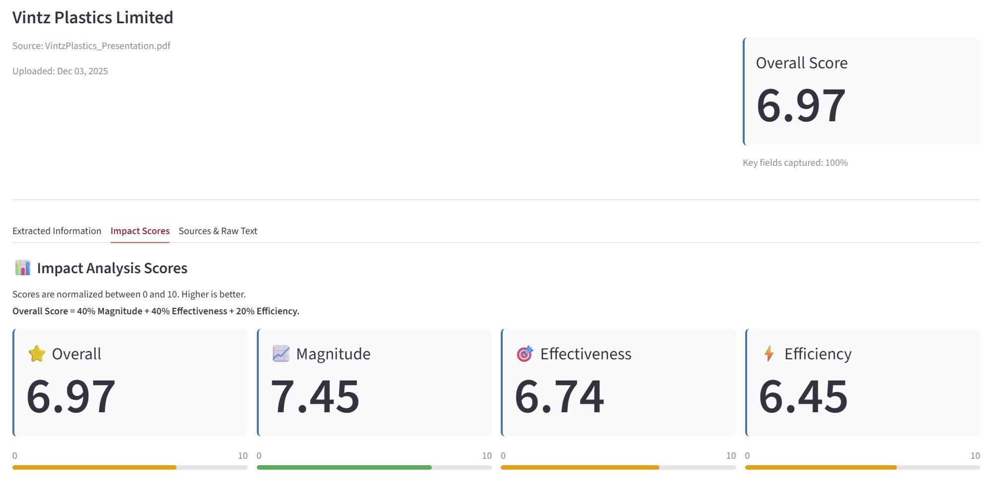
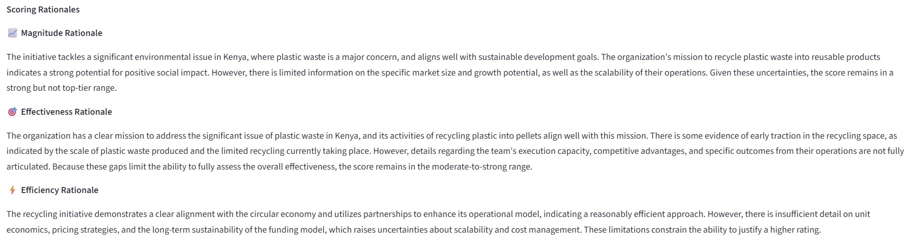
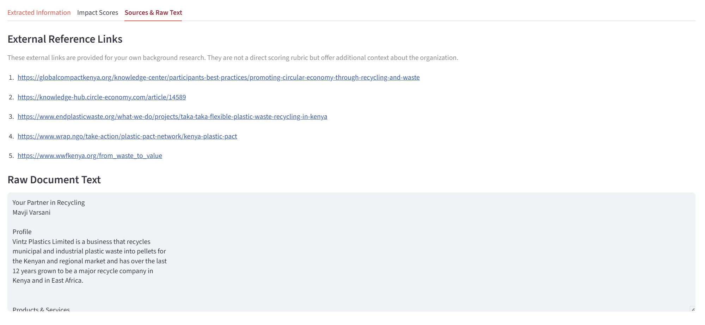

# AI-Powered Impact Analysis Tool for Social Enterprises 
*Explainable, rubric-driven NLP scoring for social impact evaluation*

A Streamlit-based tool that helps reviewers **extract, score, and compare** social enterprise business plans with a **rubric-driven (prompt-based) LLM scoring system** and **RAG-based semantic search**.

This project was developed collaboratively as part of a graduate NLP course team project and sponsored by Santa Clara University Miller Center.

> Full Team Repository (codebase, infrastructure, deployment): [(link to Team project repo)](https://github.com/henry-xrk/ISBA2411_NLP_Final_Project)

> My portfolio repo focuses on: **what I built + how it works + business impact**.

This repository highlights my individual contributions, design decisions, and analytical reasoning.

---

## Project Overview
Evaluating social enterprise business plans is often time-consuming and subjective.
Reviewers must manually read long documents, extract key information, and assess impact across multiple qualitative dimensions.

This tool streamlines that process by:
- Automatically extracting key sections (mission, problem, description, etc.) from business plans
- Generating 3 impact scores with clear rationales:
  - Magnitude
  - Effectiveness
  - Efficiency
- Providing supplementary external research snippets to support reviewer context
- Enabling consistent, data-driven comparison across organizations
- Enabling Q&A via an “Analysis Agent” (RAG optional)

---

## My Role & Contributions

I owned the end-to-end impact scoring and research pipeline, focusing on making LLM-based evaluation transparent, explainable, and reviewer-friendly.

My responsibilities included:
- Rubric-Based Impact Scoring
  - Designed and implemented prompt-based scoring for:
      - Magnitude
      - Effectiveness
      - Efficiency
  - Enforced structured JSON outputs to ensure consistency and interpretability
  - Implemented configurable overall score weighting (0–10 scale) to support different reviewer priorities

- Rationale Generation
  - Generated concise, human-readable rationales explaining why each score was assigned
  - Ensured rationales were grounded in the business plan text rather than generic LLM responses

- External Research Integration
  - Implemented supplementary research retrieval to provide additional context
  - Treated external sources as supporting evidence only, not primary scoring inputs
  - Added guardrails to reduce hallucination and enforce citation discipline

- Scoring UI Refinement
  - Iterated on Streamlit UI to clearly present:
      - Individual dimension scores
      - Overall score
      - Associated rationales and evidence
  - Improved readability for non-technical reviewers

---

## Scoring Design Philosophy
Unlike black-box models, this system prioritizes explainability and trust.

Key design choices:
- No fine-tuning — scoring is entirely rubric- and prompt-driven
- Low temperature settings to reduce randomness
- Explicit scoring criteria embedded in prompts
- Human-readable rationales generated alongside numeric scores
- Configurable overall score weighting (default: 0.4 Magnitude / 0.4 Effectiveness / 0.2 Efficiency) to support different reviewer priorities

This makes the tool suitable for real review workflows where transparency matters as much as accuracy.

---
## Example Output

Below is an example walkthrough of how reviewers interact with the tool, from high-level portfolio comparison to detailed, explainable impact evaluation.

---

### 1. Portfolio-Level Overview & Cross-Organization Comparison

Reviewers begin with a **portfolio-level dashboard** that summarizes all uploaded organizations.

This overview table enables quick comparison across:
- Overall impact score
- Individual dimensions (Magnitude, Effectiveness, Efficiency)
- Upload time and source document

This view helps reviewers **prioritize which organizations deserve deeper review**.

---

### 2. Impact Scores (Explainable & Structured)

For each organization, the tool generates:
- **Magnitude**
- **Effectiveness**
- **Efficiency**
- **Overall impact score** 

Scores are normalized to a 0–10 scale and displayed clearly for fast interpretation.

---

### 3. Scoring Rationales (Transparency by Design)

Each numeric score is accompanied by a **clear, human-readable rationale** explaining:
- What evidence in the business plan supports the score
- Where uncertainties or missing details limit confidence

This ensures reviewers can **understand *why* a score was assigned**, rather than treating the model as a black box.

---

### 4. External Research & Supporting Context

To support reviewer judgment, the tool optionally surfaces **external reference links**, such as:
- Industry context
- Comparable initiatives
- Relevant policy or research sources

External information is provided **for context only** and does **not directly drive scoring**, helping maintain scoring integrity and reduce hallucination risk.

---

### Reviewer Value & Workflow Impact

Together, these outputs enable:
- Faster first-pass screening across many organizations  
- Consistent, rubric-driven evaluation  
- Transparent justification for every score  
- Better-informed human decision-making  

The tool is designed to **support reviewers, not replace them**.

---

## Tech stack (Relevant to My Contributions)
- Python
- Prompt Engineering with Structured Outputs
- OpenAI API (LLM-based scoring)
- Streamlit (Scoring & Explanation UI)
- External Web Research Integration

---

## What This Project Demonstrates
This project demonstrates my ability to:
- Translate ambiguous qualitative criteria into structured, reproducible analytical frameworks
- Design explainable LLM-based evaluation systems
- Balance technical feasibility with real-world reviewer needs
- Communicate complex NLP systems in a clear, business-oriented way
